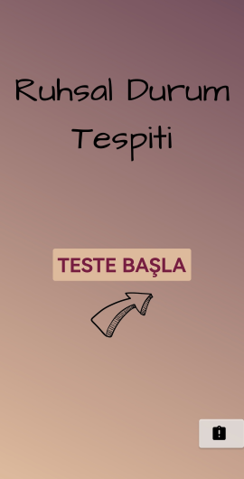
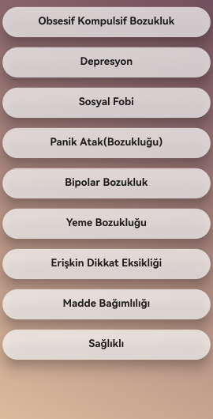
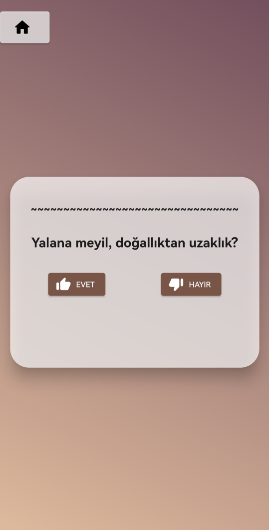
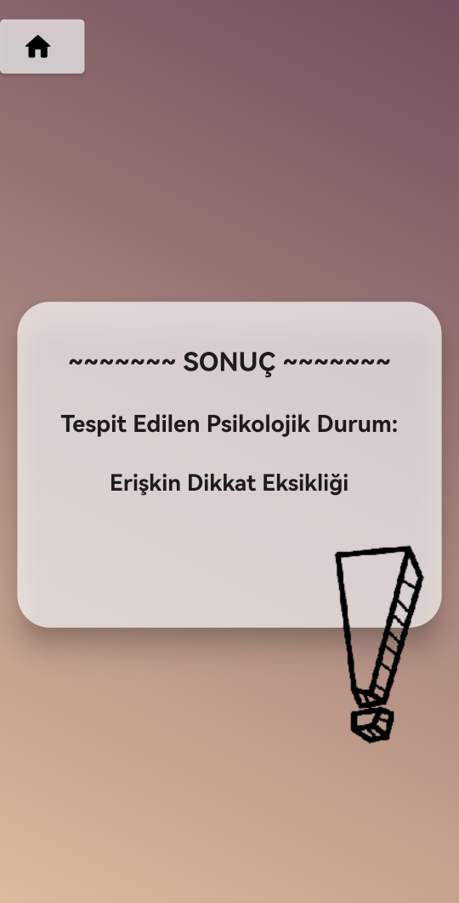

## Ruhsal Durum Tespiti

**Uzman sistemler, belirli bir uzmanlık alanında, gerçek kişilerden derlenen bilgileri temel alarak sebepten sonuca veya sonuçtan sebeplere ulaşabilen sistemlerdir. Uzman sistem birçok alanda kullanılmaktadır. Bu projede uzman sistem kullanılarak Ruhsal durum tespiti yapmak amaçlanmaktadır.**  
**Bir kişinin sağlıklı sürdürmesi gereken hayatını, sağlıklı bir şekilde sürdürmesine engel olan psikolojik rahatsızlıklar mevcuttur. Ruhsal hastalıkların mevcut durumu kişiden kişiye değişir o yüzden bireysel ve kişiye özel tedavi gerektiren rahatsızlıktır. Proje bu amaçla insanların ruhsal hastalıklarını teşhis etmek için tasarlanmıştır.** 
*Aşağıda projenin ekran görüntüleri mevcuttur. Ve ilk resim ana ekrandır.* 
 
*Veritabanında 8 adet hastalık bulunmaktadır. Bunların kendilerine ait soruları mevcuttur. Bu sorular üzerinden kullanıcılara hastalık sonucu çıkmaktadır.* 
 
*Aşağıda veritabanına eklenen sorulardan rasgele çekilmiş bir soru gelmiştir. Evet veya Hayır'ı cevaplayarak diğer sorulara geçiş yapılmaktadır.  
 
*Sorulara verilen cevaplar sayesinde hangi hastalığa sahip olduğu sonuç ekranına gelmektedir.*  
 

